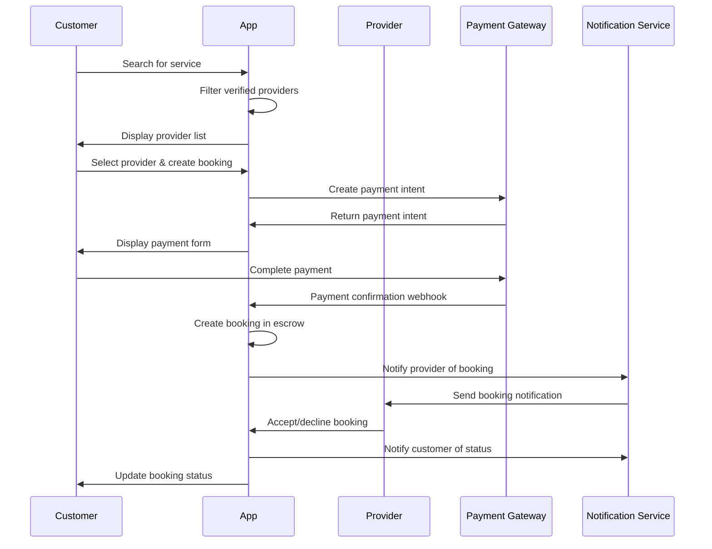
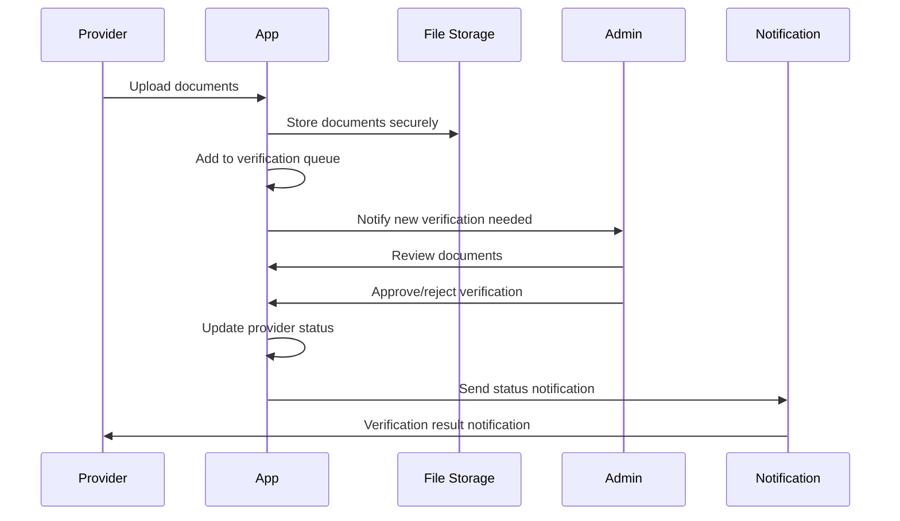

# Weda.lk Full-Stack Architecture

**Version:** 1.0  
**Date:** 2025-08-11  
**Author:** Winston (Architect)

## Introduction

This document defines the comprehensive technical architecture for Weda.lk, Sri Lanka's leading trusted home services marketplace platform. The architecture is designed to support 10,000+ concurrent users, handle police-verified service provider onboarding, and facilitate secure transactions through an escrow payment system.

### Project Overview
- **Platform Type:** Home Services Marketplace
- **Target Market:** Sri Lanka (Western, Central, Southern provinces)
- **Key Differentiator:** Police-verified service providers
- **Revenue Model:** 23% commission (18% provider + 5% customer)
- **Primary Users:** Homeowners, Service Providers, Admin Staff

## High Level Architecture

### Technical Summary
Modern full-stack web application built with Next.js 15, leveraging server-side rendering for SEO optimization and optimal performance. The architecture follows a monolithic-first approach with modular design patterns, enabling rapid development while maintaining clear separation of concerns for future microservices migration.

### Platform Choice
**Vercel + PostgreSQL + Redis Stack**
- **Frontend/Backend:** Next.js 15 with API Routes
- **Database:** PostgreSQL (managed service)
- **Caching:** Redis for sessions and frequently accessed data
- **File Storage:** AWS S3 with CloudFront CDN
- **Deployment:** Vercel for auto-scaling and edge optimization

### Repository Structure
**Monorepo Architecture** - Single repository containing frontend, backend, and shared utilities for simplified development workflow and dependency management.

### Architectural Patterns
1. **Domain-Driven Design:** Core domains (Users, Services, Bookings, Payments, Reviews)
2. **API-First Development:** RESTful APIs with OpenAPI documentation
3. **Component-Based Frontend:** Reusable React components with shadcn/ui
4. **Event-Driven Architecture:** For real-time notifications and status updates
5. **Layered Architecture:** Presentation → Business Logic → Data Access

## Tech Stack

| Category | Technology | Version | Rationale |
|----------|------------|---------|-----------|
| **Frontend Framework** | Next.js | 15.x | SSR/SSG capabilities, optimal SEO, API routes |
| **Frontend Library** | React | 19.x | Component reusability, rich ecosystem |
| **Language** | TypeScript | 5.x | Type safety, developer productivity |
| **Styling** | Tailwind CSS | 3.x | Utility-first, rapid development |
| **UI Components** | shadcn/ui | Latest | Consistent design system, accessibility |
| **Database** | PostgreSQL | 15.x | ACID compliance, complex queries, reliability |
| **Caching** | Redis | 7.x | Session management, fast data access |
| **ORM** | Prisma | 5.x | Type-safe database access, migrations |
| **Authentication** | NextAuth.js | 5.x | Multiple providers, secure session management |
| **Payment Gateway** | PayHere/Stripe | Latest | Local market leader, international support |
| **File Storage** | AWS S3 | Latest | Scalable document storage, CDN integration |
| **Maps** | Google Maps API | Latest | Location services, geocoding |
| **SMS/Email** | Twilio/SendGrid | Latest | OTP verification, notifications |
| **Animation** | GSAP | 3.x | Smooth micro-interactions, trust-building |
| **Testing** | Jest/Playwright | Latest | Unit testing, E2E testing |
| **Deployment** | Vercel | Latest | Auto-scaling, edge optimization |

## Data Models

### Core Business Entities

```typescript
// User Management
interface User {
  id: string
  email: string
  phone: string
  role: UserRole
  profile: UserProfile
  createdAt: Date
  updatedAt: Date
  verificationStatus: VerificationStatus
}

interface UserProfile {
  firstName: string
  lastName: string
  avatar?: string
  address: Address
  language: LanguagePreference
  notifications: NotificationSettings
}

// Service Provider Domain
interface ServiceProvider extends User {
  businessName: string
  services: ServiceCategory[]
  serviceAreas: ServiceArea[]
  pricing: PricingStructure
  portfolio: PortfolioItem[]
  availability: AvailabilitySchedule
  documents: VerificationDocument[]
  rating: Rating
  completedJobs: number
  responseTime: number
}

interface VerificationDocument {
  id: string
  type: DocumentType
  url: string
  status: VerificationStatus
  reviewedAt?: Date
  reviewedBy?: string
  expiryDate?: Date
}

// Booking & Transaction Domain
interface Booking {
  id: string
  customerId: string
  providerId: string
  service: ServiceDetails
  location: Address
  scheduledAt: Date
  duration: number
  status: BookingStatus
  pricing: BookingPricing
  payment: PaymentRecord
  messages: Message[]
  reviews: Review[]
  createdAt: Date
}

interface PaymentRecord {
  id: string
  bookingId: string
  amount: number
  platformFee: number
  providerPayout: number
  status: PaymentStatus
  escrowReleaseAt?: Date
  gatewayTransactionId: string
  refunds: RefundRecord[]
}

// Review & Rating System
interface Review {
  id: string
  bookingId: string
  reviewerId: string
  revieweeId: string
  rating: number
  comment?: string
  photos: string[]
  isVerified: boolean
  createdAt: Date
}
```

## API Specification

### RESTful API Design
Base URL: `https://api.weda.lk/v1`

#### Authentication Endpoints
```
POST /auth/register
POST /auth/login
POST /auth/verify-otp
POST /auth/refresh
DELETE /auth/logout
```

#### User Management
```
GET /users/profile
PUT /users/profile
POST /users/upload-avatar
GET /users/{id}/public-profile
```

#### Service Provider Management
```
GET /providers/search
GET /providers/{id}
PUT /providers/profile
POST /providers/documents
GET /providers/availability
PUT /providers/availability
GET /providers/analytics
```

#### Booking Management
```
POST /bookings
GET /bookings
GET /bookings/{id}
PUT /bookings/{id}/status
POST /bookings/{id}/messages
GET /bookings/{id}/messages
```

#### Payment Processing
```
POST /payments/create-intent
POST /payments/confirm
GET /payments/{id}/status
POST /payments/{id}/refund
GET /payments/escrow-balance
```

#### Reviews & Ratings
```
POST /reviews
GET /reviews/provider/{id}
GET /reviews/customer/{id}
PUT /reviews/{id}
DELETE /reviews/{id}
```

### Real-time Events (WebSocket)
```typescript
// Booking status updates
BookingStatusChanged {
  bookingId: string
  status: BookingStatus
  timestamp: Date
}

// New message in booking
MessageReceived {
  bookingId: string
  senderId: string
  content: string
  timestamp: Date
}

// Provider location updates
ProviderLocationUpdate {
  providerId: string
  location: Coordinates
  timestamp: Date
}
```

## Components

### Frontend Components

#### Core UI Components
```typescript
// Trust & Verification
<TrustBadge variant="police-verified" />
<VerificationStatus status="verified" expiry="2025-12-31" />

// Provider Discovery
<ProviderCard provider={provider} variant="compact" />
<ServiceCategoryGrid categories={categories} />
<LocationPicker onLocationSelect={handleLocation} />

// Booking Management
<BookingForm provider={provider} onSubmit={handleBooking} />
<BookingStatusTracker status={booking.status} />
<PaymentSummary breakdown={pricing} />

// Communication
<MessageThread bookingId={bookingId} />
<NotificationCenter userId={userId} />

// Reviews & Ratings
<RatingDisplay rating={4.8} reviewCount={127} />
<ReviewForm bookingId={bookingId} onSubmit={handleReview} />
```

### Backend Services

#### Service Architecture
```typescript
// Domain Services
class UserService {
  async registerUser(userData: CreateUserRequest): Promise<User>
  async verifyOTP(phone: string, otp: string): Promise<boolean>
  async updateProfile(userId: string, profile: UserProfile): Promise<User>
}

class ProviderService {
  async searchProviders(criteria: SearchCriteria): Promise<Provider[]>
  async verifyDocuments(providerId: string, documents: Document[]): Promise<VerificationResult>
  async updateAvailability(providerId: string, schedule: Schedule): Promise<void>
}

class BookingService {
  async createBooking(bookingData: CreateBookingRequest): Promise<Booking>
  async updateBookingStatus(bookingId: string, status: BookingStatus): Promise<void>
  async processPayment(bookingId: string, paymentData: PaymentRequest): Promise<PaymentResult>
}

// External Integration Services
class PaymentGatewayService {
  async createPaymentIntent(amount: number): Promise<PaymentIntent>
  async confirmPayment(intentId: string): Promise<PaymentResult>
  async releaseEscrow(bookingId: string): Promise<void>
}

class NotificationService {
  async sendSMS(phone: string, message: string): Promise<void>
  async sendEmail(email: string, template: string, data: any): Promise<void>
  async sendPushNotification(userId: string, message: string): Promise<void>
}
```

## External APIs

### Third-Party Integrations

| Service | Purpose | Integration Method | Fallback Strategy |
|---------|---------|-------------------|-------------------|
| **PayHere** | Primary payment gateway | REST API, webhook | Stripe as secondary |
| **Stripe** | International payments | REST API, webhook | PayHere for local cards |
| **Google Maps** | Location services, geocoding | JavaScript API, REST | Manual address input |
| **Twilio** | SMS for OTP verification | REST API | Local SMS provider |
| **SendGrid** | Email notifications | REST API | SMTP fallback |
| **AWS S3** | Document storage | SDK | Local file storage |
| **CloudFront** | CDN for static assets | SDK | Direct S3 serving |

### Integration Architecture
```typescript
// Payment Gateway Abstraction
interface PaymentGateway {
  createIntent(amount: number): Promise<PaymentIntent>
  confirmPayment(intentId: string): Promise<PaymentResult>
  refundPayment(chargeId: string, amount?: number): Promise<RefundResult>
}

class PayHereGateway implements PaymentGateway {
  // PayHere-specific implementation
}

class StripeGateway implements PaymentGateway {
  // Stripe-specific implementation
}

// Gateway Factory
class PaymentGatewayFactory {
  static create(preferredGateway: string): PaymentGateway {
    return preferredGateway === 'payhere' ? 
      new PayHereGateway() : 
      new StripeGateway()
  }
}
```

## Core Workflows

### Service Booking Workflow


### Provider Verification Workflow


## Database Schema

### PostgreSQL Schema Design

```sql
-- User Management
CREATE TABLE users (
    id UUID PRIMARY KEY DEFAULT gen_random_uuid(),
    email VARCHAR(255) UNIQUE NOT NULL,
    phone VARCHAR(20) UNIQUE NOT NULL,
    password_hash TEXT NOT NULL,
    role VARCHAR(20) NOT NULL DEFAULT 'customer',
    verification_status VARCHAR(20) NOT NULL DEFAULT 'unverified',
    created_at TIMESTAMP WITH TIME ZONE DEFAULT NOW(),
    updated_at TIMESTAMP WITH TIME ZONE DEFAULT NOW()
);

CREATE TABLE user_profiles (
    user_id UUID PRIMARY KEY REFERENCES users(id) ON DELETE CASCADE,
    first_name VARCHAR(100) NOT NULL,
    last_name VARCHAR(100) NOT NULL,
    avatar_url TEXT,
    language VARCHAR(10) DEFAULT 'en',
    address JSONB,
    notification_settings JSONB
);

-- Service Provider Domain
CREATE TABLE service_providers (
    user_id UUID PRIMARY KEY REFERENCES users(id) ON DELETE CASCADE,
    business_name VARCHAR(200) NOT NULL,
    description TEXT,
    services TEXT[] NOT NULL,
    service_areas JSONB NOT NULL,
    pricing JSONB,
    availability JSONB,
    rating DECIMAL(2,1) DEFAULT 0,
    completed_jobs INTEGER DEFAULT 0,
    response_time_minutes INTEGER DEFAULT 0,
    is_active BOOLEAN DEFAULT false
);

CREATE TABLE verification_documents (
    id UUID PRIMARY KEY DEFAULT gen_random_uuid(),
    provider_id UUID REFERENCES service_providers(user_id) ON DELETE CASCADE,
    document_type VARCHAR(50) NOT NULL,
    file_url TEXT NOT NULL,
    status VARCHAR(20) DEFAULT 'pending',
    reviewed_at TIMESTAMP WITH TIME ZONE,
    reviewed_by UUID REFERENCES users(id),
    expiry_date DATE,
    created_at TIMESTAMP WITH TIME ZONE DEFAULT NOW()
);

-- Booking & Transaction Domain
CREATE TABLE bookings (
    id UUID PRIMARY KEY DEFAULT gen_random_uuid(),
    customer_id UUID REFERENCES users(id) ON DELETE RESTRICT,
    provider_id UUID REFERENCES service_providers(user_id) ON DELETE RESTRICT,
    service_details JSONB NOT NULL,
    service_location JSONB NOT NULL,
    scheduled_at TIMESTAMP WITH TIME ZONE NOT NULL,
    duration_minutes INTEGER,
    status VARCHAR(20) DEFAULT 'pending',
    pricing JSONB NOT NULL,
    special_instructions TEXT,
    created_at TIMESTAMP WITH TIME ZONE DEFAULT NOW(),
    updated_at TIMESTAMP WITH TIME ZONE DEFAULT NOW()
);

CREATE TABLE payment_records (
    id UUID PRIMARY KEY DEFAULT gen_random_uuid(),
    booking_id UUID REFERENCES bookings(id) ON DELETE RESTRICT,
    amount DECIMAL(10,2) NOT NULL,
    platform_fee DECIMAL(10,2) NOT NULL,
    provider_payout DECIMAL(10,2) NOT NULL,
    status VARCHAR(20) DEFAULT 'pending',
    payment_gateway VARCHAR(20) NOT NULL,
    gateway_transaction_id TEXT,
    escrow_release_at TIMESTAMP WITH TIME ZONE,
    created_at TIMESTAMP WITH TIME ZONE DEFAULT NOW()
);

-- Communication
CREATE TABLE messages (
    id UUID PRIMARY KEY DEFAULT gen_random_uuid(),
    booking_id UUID REFERENCES bookings(id) ON DELETE CASCADE,
    sender_id UUID REFERENCES users(id) ON DELETE CASCADE,
    content TEXT NOT NULL,
    message_type VARCHAR(20) DEFAULT 'text',
    attachments JSONB,
    created_at TIMESTAMP WITH TIME ZONE DEFAULT NOW()
);

-- Reviews & Ratings
CREATE TABLE reviews (
    id UUID PRIMARY KEY DEFAULT gen_random_uuid(),
    booking_id UUID REFERENCES bookings(id) ON DELETE CASCADE,
    reviewer_id UUID REFERENCES users(id) ON DELETE CASCADE,
    reviewee_id UUID REFERENCES users(id) ON DELETE CASCADE,
    rating INTEGER NOT NULL CHECK (rating >= 1 AND rating <= 5),
    comment TEXT,
    photos TEXT[],
    is_verified BOOLEAN DEFAULT true,
    created_at TIMESTAMP WITH TIME ZONE DEFAULT NOW()
);

-- Indexing Strategy
CREATE INDEX idx_users_phone ON users(phone);
CREATE INDEX idx_users_email ON users(email);
CREATE INDEX idx_bookings_customer_id ON bookings(customer_id);
CREATE INDEX idx_bookings_provider_id ON bookings(provider_id);
CREATE INDEX idx_bookings_status ON bookings(status);
CREATE INDEX idx_bookings_scheduled_at ON bookings(scheduled_at);
CREATE INDEX idx_service_providers_services ON service_providers USING GIN(services);
CREATE INDEX idx_service_providers_location ON service_providers USING GIN(service_areas);
```

## Frontend Architecture

### Component Organization
```
src/
├── app/                    # Next.js 15 App Router
│   ├── (auth)/            # Auth route group
│   ├── (customer)/        # Customer dashboard
│   ├── (provider)/        # Provider dashboard
│   ├── (admin)/           # Admin console
│   └── api/               # API routes
├── components/            # Reusable components
│   ├── ui/               # shadcn/ui components
│   ├── forms/            # Form components
│   ├── layout/           # Layout components
│   └── domain/           # Domain-specific components
├── lib/                  # Utility functions
│   ├── auth.ts          # Authentication logic
│   ├── db.ts            # Database client
│   ├── payments.ts      # Payment integrations
│   └── utils.ts         # General utilities
├── hooks/               # Custom React hooks
├── types/               # TypeScript type definitions
└── styles/              # Global styles
```

### State Management
```typescript
// Zustand for client state
interface AppState {
  user: User | null
  location: Location | null
  searchFilters: SearchFilters
  bookings: Booking[]
}

// React Query for server state
const useProviders = (searchCriteria: SearchCriteria) => {
  return useQuery({
    queryKey: ['providers', searchCriteria],
    queryFn: () => searchProviders(searchCriteria),
    staleTime: 5 * 60 * 1000 // 5 minutes
  })
}

// Context for theme and language
const AppContext = createContext<{
  theme: 'light' | 'dark'
  language: 'en' | 'si' | 'ta'
  setTheme: (theme: 'light' | 'dark') => void
  setLanguage: (lang: 'en' | 'si' | 'ta') => void
}>()
```

### Routing Strategy
```typescript
// App Router structure
app/
├── page.tsx                    # Landing page
├── search/
│   └── page.tsx               # Service search
├── provider/
│   └── [id]/
│       └── page.tsx           # Provider profile
├── booking/
│   ├── new/page.tsx           # New booking form
│   └── [id]/page.tsx          # Booking details
├── dashboard/
│   ├── customer/              # Customer routes
│   └── provider/              # Provider routes
└── admin/                     # Admin routes (protected)
```

## Backend Architecture

### Service Layer Architecture
```typescript
// Repository Pattern for data access
interface UserRepository {
  findById(id: string): Promise<User | null>
  findByEmail(email: string): Promise<User | null>
  create(userData: CreateUserRequest): Promise<User>
  update(id: string, updates: Partial<User>): Promise<User>
}

// Business Logic Layer
class BookingService {
  constructor(
    private bookingRepo: BookingRepository,
    private paymentService: PaymentService,
    private notificationService: NotificationService
  ) {}

  async createBooking(bookingData: CreateBookingRequest): Promise<Booking> {
    // Business logic for booking creation
    const booking = await this.bookingRepo.create(bookingData)
    await this.paymentService.createEscrow(booking.id, booking.totalAmount)
    await this.notificationService.notifyProvider(booking.providerId, booking)
    return booking
  }
}

// API Route Handlers
// app/api/bookings/route.ts
export async function POST(request: Request) {
  const session = await getServerSession()
  if (!session) return NextResponse.json({error: 'Unauthorized'}, {status: 401})
  
  const bookingData = await request.json()
  const booking = await bookingService.createBooking(bookingData)
  
  return NextResponse.json(booking)
}
```

### Authentication Strategy
```typescript
// NextAuth.js configuration
export const authOptions: NextAuthOptions = {
  providers: [
    CredentialsProvider({
      async authorize(credentials) {
        const user = await verifyCredentials(credentials)
        return user || null
      }
    }),
    GoogleProvider({
      clientId: process.env.GOOGLE_CLIENT_ID!,
      clientSecret: process.env.GOOGLE_CLIENT_SECRET!
    })
  ],
  session: { strategy: 'jwt' },
  callbacks: {
    jwt: async ({ token, user }) => {
      if (user) token.role = user.role
      return token
    },
    session: async ({ session, token }) => {
      session.user.role = token.role
      return session
    }
  }
}

// Role-based access control
export const withAuth = (handler: NextApiHandler, allowedRoles: string[]) => {
  return async (req: NextApiRequest, res: NextApiResponse) => {
    const session = await getServerSession(req, res, authOptions)
    
    if (!session || !allowedRoles.includes(session.user.role)) {
      return res.status(403).json({ error: 'Forbidden' })
    }
    
    return handler(req, res)
  }
}
```

## Unified Project Structure

### Monorepo Organization
```
weda-lk/
├── .next/                     # Next.js build output
├── .bmad-core/               # BMad AI agent configuration
├── docs/                     # Documentation
│   ├── prd.md               # Product requirements
│   ├── front-end-spec.md    # UX specifications
│   └── architecture.md      # This document
├── public/                   # Static assets
│   ├── images/              # Images and icons
│   └── locales/             # Translation files
├── src/                     # Application source code
│   ├── app/                 # Next.js App Router
│   ├── components/          # React components
│   ├── lib/                 # Utilities and configs
│   ├── hooks/               # Custom React hooks
│   ├── types/               # TypeScript definitions
│   └── styles/              # Styling files
├── prisma/                  # Database schema and migrations
│   ├── schema.prisma        # Prisma schema
│   └── migrations/          # Database migrations
├── tests/                   # Test files
│   ├── __tests__/          # Unit tests
│   ├── e2e/                # End-to-end tests
│   └── utils/              # Test utilities
├── .env.example             # Environment variables template
├── .gitignore              # Git ignore rules
├── next.config.ts          # Next.js configuration
├── package.json            # Dependencies and scripts
├── tsconfig.json           # TypeScript configuration
├── tailwind.config.ts      # Tailwind CSS configuration
└── README.md               # Project documentation
```

## Development Workflow

### Local Development Setup
```bash
# Environment setup
npm install
cp .env.example .env.local
# Configure environment variables

# Database setup
npx prisma generate
npx prisma db push
npx prisma db seed

# Start development server
npm run dev

# Run tests
npm run test
npm run test:e2e

# Type checking
npm run type-check

# Linting and formatting
npm run lint
npm run format
```

### Development Scripts
```json
{
  "scripts": {
    "dev": "next dev",
    "build": "next build",
    "start": "next start",
    "type-check": "tsc --noEmit",
    "lint": "next lint",
    "format": "prettier --write .",
    "test": "jest",
    "test:watch": "jest --watch",
    "test:e2e": "playwright test",
    "db:generate": "prisma generate",
    "db:migrate": "prisma migrate dev",
    "db:seed": "tsx prisma/seed.ts",
    "db:studio": "prisma studio"
  }
}
```

## Deployment Architecture

### Production Environment (Vercel)
```yaml
# vercel.json
{
  "buildCommand": "npm run build",
  "devCommand": "npm run dev",
  "installCommand": "npm install",
  "framework": "nextjs",
  "env": {
    "DATABASE_URL": "@database-url",
    "REDIS_URL": "@redis-url",
    "NEXTAUTH_SECRET": "@nextauth-secret",
    "PAYHERE_MERCHANT_ID": "@payhere-merchant-id",
    "STRIPE_SECRET_KEY": "@stripe-secret-key"
  }
}
```

### CI/CD Pipeline
```yaml
# .github/workflows/deploy.yml
name: Deploy to Production
on:
  push:
    branches: [main]

jobs:
  test:
    runs-on: ubuntu-latest
    steps:
      - uses: actions/checkout@v3
      - uses: actions/setup-node@v3
        with:
          node-version: '18'
      - run: npm ci
      - run: npm run type-check
      - run: npm run lint
      - run: npm run test
      - run: npm run test:e2e

  deploy:
    needs: test
    runs-on: ubuntu-latest
    steps:
      - uses: actions/checkout@v3
      - uses: amondnet/vercel-action@v25
        with:
          vercel-token: ${{ secrets.VERCEL_TOKEN }}
          vercel-org-id: ${{ secrets.ORG_ID }}
          vercel-project-id: ${{ secrets.PROJECT_ID }}
          vercel-args: '--prod'
```

## Security and Performance

### Security Requirements
1. **Authentication & Authorization**
   - JWT tokens with secure httpOnly cookies
   - Role-based access control (RBAC)
   - Multi-factor authentication for admin users
   - Session timeout and refresh token rotation

2. **Data Protection**
   - All sensitive data encrypted at rest
   - PII data anonymization for analytics
   - GDPR compliance for data deletion
   - Secure file upload with virus scanning

3. **API Security**
   - Rate limiting (100 requests/minute per IP)
   - Input validation and sanitization
   - SQL injection prevention via Prisma ORM
   - CORS configuration for allowed origins

4. **Payment Security**
   - PCI DSS compliance through gateway integration
   - No card data stored on servers
   - Webhook signature verification
   - Escrow account audit trails

### Performance Optimization
1. **Frontend Performance**
   - Next.js Image optimization
   - Code splitting and lazy loading
   - Service worker for offline functionality
   - CDN for static assets (CloudFront)

2. **Backend Performance**
   - Database query optimization with indexes
   - Redis caching for frequently accessed data
   - Connection pooling for database connections
   - API response compression

3. **Monitoring & Observability**
   - Application performance monitoring (APM)
   - Error tracking and alerting
   - Real-time performance metrics
   - User experience monitoring

## Testing Strategy

### Testing Pyramid
```typescript
// Unit Tests (Jest)
describe('BookingService', () => {
  it('should create booking with escrow payment', async () => {
    const bookingService = new BookingService(mockRepo, mockPayment, mockNotification)
    const booking = await bookingService.createBooking(mockBookingData)
    
    expect(booking).toBeDefined()
    expect(mockPayment.createEscrow).toHaveBeenCalled()
  })
})

// Integration Tests
describe('Booking API', () => {
  it('POST /api/bookings should create new booking', async () => {
    const response = await request(app)
      .post('/api/bookings')
      .set('Authorization', `Bearer ${authToken}`)
      .send(bookingData)
    
    expect(response.status).toBe(201)
    expect(response.body.id).toBeDefined()
  })
})

// E2E Tests (Playwright)
test('complete booking flow', async ({ page }) => {
  await page.goto('/search')
  await page.click('[data-testid="provider-card"]')
  await page.click('[data-testid="book-service"]')
  await page.fill('[data-testid="service-details"]', 'Kitchen sink repair')
  await page.click('[data-testid="confirm-booking"]')
  await expect(page.locator('[data-testid="booking-confirmation"]')).toBeVisible()
})
```

### Test Coverage Goals
- Unit Tests: 80% code coverage
- Integration Tests: All API endpoints
- E2E Tests: Critical user journeys
- Performance Tests: Load testing for 10K concurrent users

## Monitoring and Observability

### Key Metrics
1. **Business Metrics**
   - Booking conversion rate
   - Provider verification time
   - Customer satisfaction scores
   - Revenue per transaction

2. **Technical Metrics**
   - API response times (P95 < 500ms)
   - Database query performance
   - Error rates by service
   - Uptime and availability

3. **User Experience Metrics**
   - Core Web Vitals (LCP, FID, CLS)
   - Page load times
   - Mobile performance scores
   - Search result relevance

### Monitoring Stack
```typescript
// Application monitoring
import { Analytics } from '@vercel/analytics'
import { SpeedInsights } from '@vercel/speed-insights/next'

// Error tracking
import * as Sentry from '@sentry/nextjs'

// Custom metrics
const trackBookingCreated = (bookingId: string) => {
  analytics.track('Booking Created', {
    bookingId,
    timestamp: new Date().toISOString()
  })
}
```

## Conclusion

This architecture provides a solid foundation for Weda.lk's marketplace platform, designed to handle the specific requirements of the Sri Lankan market while maintaining scalability and security. The monolithic-first approach enables rapid development and deployment, while the modular design allows for future evolution into microservices as the platform grows.

The architecture prioritizes user trust through verification systems, payment security through escrow mechanisms, and operational efficiency through comprehensive monitoring and observability.