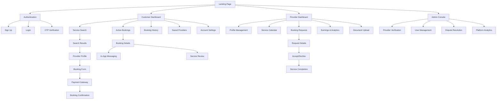
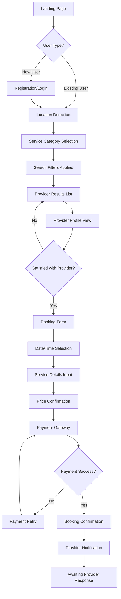
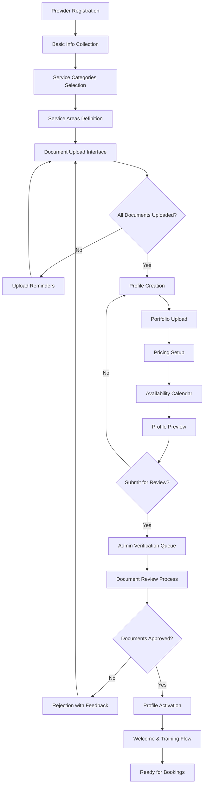
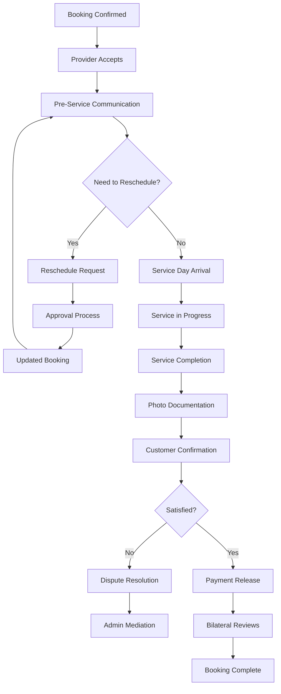

# Weda.lk UI/UX Specification

This document defines the user experience goals, information architecture, user flows, and visual design specifications for Weda.lk's user interface. It serves as the foundation for visual design and frontend development, ensuring a cohesive and user-centered experience.

## Overall UX Goals & Principles

### Target User Personas

- **Homeowners/Service Seekers:** Busy professionals and families who need reliable, verified home services but lack time to vet providers through traditional word-of-mouth
- **Service Providers:** Skilled tradespeople seeking consistent work opportunities and wanting to build professional reputation through a trusted platform
- **Admin Users:** Platform managers who need efficient tools to verify providers and maintain marketplace quality

### Usability Goals

- **Trust-building:** Users can immediately identify verified providers and understand verification status
- **Quick discovery:** Customers can find relevant service providers within 30 seconds of landing
- **Seamless booking:** Complete service booking flow takes less than 3 minutes
- **Transparent pricing:** All costs and fees are clearly visible before payment

### Design Principles

1. **Verification-first visibility** - Police clearance and trust indicators prominently displayed
2. **Cultural familiarity** - Interface patterns that feel natural to Sri Lankan users
3. **Mobile-first accessibility** - Optimized for smartphones as primary device
4. **Bilingual inclusivity** - Seamless language switching between English, Sinhala, Tamil
5. **Transparent trust-building** - Clear pricing, genuine reviews, and verification status

### Change Log

| Date       | Version | Description                          | Author            |
| ---------- | ------- | ------------------------------------ | ----------------- |
| 2025-08-11 | 1.0     | Initial UI/UX specification creation | Sally (UX Expert) |

---

## Information Architecture (IA)

### Site Map / Screen Inventory

### Navigation Structure

**Primary Navigation:**

- **Customer App:** Bottom tab navigation (Search, Bookings, Messages, Profile) for thumb-friendly mobile access
- **Provider App:** Bottom tab navigation (Calendar, Requests, Earnings, Profile) optimized for quick task switching
- **Desktop:** Top horizontal navigation with clear role-based sections

**Secondary Navigation:**

- Contextual sub-menus within each primary section
- Breadcrumb navigation for deep pages (booking flow, profile editing)
- Quick action floating buttons for primary tasks (Book Service, Accept Request)

**Breadcrumb Strategy:**

- Essential for multi-step flows (booking, verification, profile setup)
- Category-based breadcrumbs for service browsing (Home > Plumbing > Emergency Repairs)
- Skip breadcrumbs on mobile for space efficiency, use back button navigation instead

---

## User Flows

### Flow 1: Customer Service Discovery & Booking

**User Goal:** Find and book a verified service provider for a specific home service need

**Entry Points:**

- Landing page service category selection
- Search bar on homepage
- Direct URL from marketing campaigns
- Returning user dashboard

**Success Criteria:**

- Customer completes payment and receives booking confirmation
- Provider accepts booking request
- Both parties have clear next steps

#### Flow Diagram

#### Edge Cases & Error Handling:

- No providers available in user's location → Expand radius suggestion
- Provider rejects booking → Alternative provider recommendations
- Payment failure → Multiple retry options with different payment methods
- Network interruption during booking → Form data persistence and recovery
- Provider unavailable after booking → Automatic rebooking flow

**Notes:** This flow includes the escrow payment system from Epic 3, ensuring payment security while building trust between parties.

### Flow 2: Provider Onboarding & Verification

**User Goal:** Join the platform as a verified service provider ready to receive bookings

**Entry Points:**

- Landing page "Become a Provider" CTA
- Referral links from existing providers
- Marketing campaigns targeted at service professionals

**Success Criteria:**

- Provider profile is live and discoverable
- All verification documents approved
- Provider can receive and respond to booking requests

#### Flow Diagram

#### Edge Cases & Error Handling:

- Invalid/expired documents → Clear guidance on acceptable document types
- Profile rejected multiple times → Phone support escalation
- Long verification delays → Status updates and estimated timeline
- Provider changes service areas → Re-verification process
- Document upload failures → Multiple upload methods and formats

**Notes:** This flow implements the police clearance verification from Epic 1, ensuring platform trust and safety standards.

### Flow 3: In-App Booking Management & Communication

**User Goal:** Manage active bookings with clear communication and status updates

**Entry Points:**

- Booking confirmation email/SMS links
- Dashboard active bookings section
- Push notifications for booking updates

**Success Criteria:**

- Both parties stay informed of booking status
- Any issues are resolved through platform tools
- Service completion and payment release occur smoothly

#### Flow Diagram

#### Edge Cases & Error Handling:

- Provider no-show → Automatic refund and rebooking options
- Service quality disputes → Structured evidence collection
- Communication breakdown → Admin intervention triggers
- Emergency cancellations → Fair cancellation policies with partial refunds
- Technical issues preventing completion confirmation → Manual override process

**Notes:** This flow incorporates the escrow payment system and bilateral review system from Epics 3 and 4.

---

## Wireframes & Mockups

**Primary Design Files:** To be created in Figma workspace - recommend organizing into the following frames:

- **Customer Mobile App** (iOS/Android designs)
- **Provider Mobile App** (iOS/Android designs)
- **Responsive Web Platform** (Tablet/Desktop layouts)
- **Admin Dashboard** (Desktop-focused interface)

### Key Screen Layouts

#### Landing Page (Mobile)

**Purpose:** Convert visitors into registered users while building trust through verification messaging

**Key Elements:**

- Hero section with "Police-Verified Service Providers" value proposition
- Service category grid (6 main categories with icons)
- Location detection prompt with manual fallback
- Trust indicators carousel (verification process, customer testimonials)
- Dual CTAs: "Find Services" (customer) and "Join as Provider" (provider)

**Interaction Notes:** Sticky header with location and quick search, parallax scroll for trust-building sections, smooth category card animations

**Design File Reference:** Landing-Mobile-Hero.frame in Figma

#### Service Search Results (Mobile)

**Purpose:** Help customers quickly evaluate and compare verified providers

**Key Elements:**

- Map view toggle showing provider locations
- Provider cards with verification badges, ratings, distance, and pricing preview
- Filter panel (slide-up modal): price range, rating, availability, verification status
- Sort options: distance, rating, price, response time
- "No results" state with radius expansion suggestion

**Interaction Notes:** Infinite scroll loading, swipe gestures for provider cards, filter persistence across sessions

**Design File Reference:** Search-Results-Mobile.frame in Figma

#### Provider Profile (Mobile)

**Purpose:** Build customer confidence through comprehensive provider information and clear booking path

**Key Elements:**

- Hero section with verification badges, rating, and response time
- Portfolio gallery with before/after project photos
- Services & pricing breakdown with transparent rate structure
- Customer reviews with authenticity indicators
- Availability calendar with open slots highlighted
- Primary CTA: "Book Service" button (fixed bottom position)

**Interaction Notes:** Gallery lightbox with swipe navigation, expandable reviews section, calendar date selection with time slots

**Design File Reference:** Provider-Profile-Mobile.frame in Figma

#### Booking Form (Mobile)

**Purpose:** Capture service requirements while maintaining booking momentum

**Key Elements:**

- Service selection dropdown with custom option
- Date/time picker with provider availability integration
- Address input with GPS detection and Google Maps integration
- Service details text area with photo upload capability
- Price breakdown showing service cost, platform fee, and total
- Secure payment method selection

**Interaction Notes:** Smart form validation, address autocomplete, real-time price calculation, payment method carousel

**Design File Reference:** Booking-Form-Mobile.frame in Figma

#### Provider Dashboard (Mobile)

**Purpose:** Enable efficient booking management and business performance tracking

**Key Elements:**

- Today's schedule with upcoming bookings
- Pending request notifications with quick accept/decline
- Weekly earnings summary with payout status
- Quick actions: update availability, view profile, message customers
- Performance metrics: rating, response time, completion rate

**Interaction Notes:** Pull-to-refresh for new requests, swipe actions on booking cards, quick toggle for availability status

**Design File Reference:** Provider-Dashboard-Mobile.frame in Figma

---

## Component Library / Design System

**Design System Approach:** Build a custom design system using **shadcn/ui** as the foundation, as specified in your PRD's technical stack. This provides production-ready React components with Tailwind CSS styling, allowing for rapid development while maintaining design consistency. The system will be enhanced with Weda.lk-specific components for marketplace functionality.

### Core Components

#### Trust Badge

**Purpose:** Display verification status and build customer confidence throughout the platform

**Variants:**

- Police Verified (primary green badge with shield icon)
- Identity Verified (blue badge with ID icon)
- Professional Certified (gold badge with certificate icon)
- Platform Verified (gray badge with checkmark icon)

**States:** Active, expired (with warning indicator), pending verification

**Usage Guidelines:** Always pair with tooltip explaining verification type. Use in provider cards, profiles, and booking confirmations. Never use on unverified providers.

#### Provider Card

**Purpose:** Consistently display provider information across search results, favorites, and recommendations

**Variants:**

- Compact (search results, mobile lists)
- Expanded (featured providers, desktop grid)
- Minimal (quick selection contexts)

**States:** Available, busy, offline, suspended

**Usage Guidelines:** Always include verification badges, rating, and distance. Show pricing when relevant to context. Use consistent image aspect ratios (4:3 for provider photos).

#### Rating Display

**Purpose:** Show provider ratings with visual consistency and clarity

**Variants:**

- Full stars with decimal (4.8/5.0)
- Star icons only (mobile compact)
- Bar graph breakdown (detailed profile views)

**States:** No ratings yet, low sample size warning, verified reviews indicator

**Usage Guidelines:** Always show review count alongside rating. Use yellow/gold star colors. Include authenticity indicators for verified reviews.

#### Booking Status Tracker

**Purpose:** Provide clear status communication throughout the service lifecycle

**Variants:**

- Linear progress (mobile booking flow)
- Circular status (dashboard summaries)
- Timeline view (detailed booking history)

**States:** Requested, Confirmed, In Progress, Completed, Disputed, Cancelled

**Usage Guidelines:** Use consistent color coding (blue for progress, green for completion, red for issues). Include estimated time remaining when applicable.

#### Payment Summary

**Purpose:** Transparent cost breakdown building trust in pricing

**Variants:**

- Inline (within booking forms)
- Modal (confirmation dialogs)
- Receipt (post-payment confirmation)

**States:** Estimate, confirmed, processing, completed, refunded

**Usage Guidelines:** Always break down: service cost, platform fee (23%), taxes, total. Use clear visual hierarchy. Highlight savings or discounts prominently.

#### Location Picker

**Purpose:** Accurate address collection for service delivery

**Variants:**

- Map interface with pin dropping
- Address search with autocomplete
- Current location detection

**States:** Detecting location, manual entry, address confirmed, out of service area

**Usage Guidelines:** Always provide manual fallback for GPS detection. Show service area coverage clearly. Use Google Maps integration for consistency.

---

## Branding & Style Guide

### Visual Identity

**Brand Guidelines:** To be developed - recommend creating comprehensive brand guidelines that reflect Sri Lankan cultural elements while maintaining international marketplace credibility and trust.

### Color Palette

| Color Type | Hex Code                                    | Usage                                                          |
| ---------- | ------------------------------------------- | -------------------------------------------------------------- |
| Primary    | #1B4332                                     | Trust/verification badges, primary CTAs, navigation highlights |
| Secondary  | #2D6A4F                                     | Secondary actions, hover states, accent elements               |
| Accent     | #40916C                                     | Success states, positive feedback, completion indicators       |
| Success    | #52B788                                     | Positive feedback, confirmations, payment success              |
| Warning    | #F77F00                                     | Cautions, important notices, pending verifications             |
| Error      | #D62828                                     | Errors, destructive actions, failed transactions               |
| Neutral    | #495057, #6C757D, #ADB5BD, #DEE2E6, #F8F9FA | Text hierarchy, borders, backgrounds, disabled states          |

### Typography

#### Font Families

- **Primary:** Inter (excellent readability, professional appearance, multi-language support)
- **Secondary:** Poppins (friendly, approachable headings with good Sinhala/Tamil compatibility)
- **Monospace:** JetBrains Mono (technical information, codes, data display)

#### Type Scale

| Element | Size            | Weight         | Line Height |
| ------- | --------------- | -------------- | ----------- |
| H1      | 2.5rem (40px)   | 700 (Bold)     | 1.2         |
| H2      | 2rem (32px)     | 600 (SemiBold) | 1.3         |
| H3      | 1.5rem (24px)   | 600 (SemiBold) | 1.4         |
| Body    | 1rem (16px)     | 400 (Regular)  | 1.6         |
| Small   | 0.875rem (14px) | 400 (Regular)  | 1.5         |

### Iconography

**Icon Library:** Lucide React (consistent with shadcn/ui, optimized for React, clean minimal style)

**Usage Guidelines:**

- Use 24px icons for primary actions, 16px for supporting elements
- Maintain consistent stroke weight (1.5px) across all icons
- Use filled versions for active/selected states
- Ensure icons work well in both light and dark themes

### Spacing & Layout

**Grid System:** 12-column CSS Grid with 24px gutters on desktop, 16px on mobile

**Spacing Scale:**

- Base unit: 4px
- Scale: 4px, 8px, 12px, 16px, 24px, 32px, 48px, 64px, 96px, 128px
- Mobile padding: 16px minimum
- Desktop padding: 24px minimum
- Component spacing: 16px between related elements, 32px between sections

---

## Accessibility Requirements

### Compliance Target

**Standard:** WCAG 2.1 AA compliance with progressive enhancement toward AAA where feasible, ensuring usability across diverse digital literacy levels in the Sri Lankan market.

### Key Requirements

**Visual:**

- Color contrast ratios: 4.5:1 minimum for normal text, 3:1 for large text (18px+/24px+ regular)
- Focus indicators: 2px solid outline with 2px offset, using primary color (#1B4332) with sufficient contrast
- Text sizing: Minimum 16px base font size, scalable to 200% without horizontal scrolling

**Interaction:**

- Keyboard navigation: Full tab order through all interactive elements, skip links to main content
- Screen reader support: Semantic HTML, proper ARIA labels, descriptive alt text, status announcements
- Touch targets: Minimum 44px × 44px for all interactive elements, adequate spacing between targets

**Content:**

- Alternative text: Descriptive alt text for all images, especially provider portfolio photos and verification badges
- Heading structure: Logical H1-H6 hierarchy with no skipped levels, descriptive headings
- Form labels: Explicit labels for all form inputs, error messages associated with relevant fields

### Testing Strategy

**Automated Testing:**

- axe-core integration in development pipeline for continuous accessibility monitoring
- Lighthouse accessibility audits on all key user flows
- Color contrast validation using WebAIM tools

**Manual Testing:**

- Screen reader testing with NVDA (free option) and VoiceOver (iOS/macOS)
- Keyboard-only navigation testing across all user flows
- Mobile accessibility testing with TalkBack (Android) and VoiceOver (iOS)
- User testing with individuals who use assistive technologies

**Ongoing Monitoring:**

- Regular accessibility audits during feature development
- User feedback channels specifically for accessibility issues
- Staff training on accessibility principles and testing methods

---

## Responsiveness Strategy

### Breakpoints

| Breakpoint | Min Width | Max Width | Target Devices                                        |
| ---------- | --------- | --------- | ----------------------------------------------------- |
| Mobile     | 320px     | 767px     | Smartphones, small tablets in portrait                |
| Tablet     | 768px     | 1023px    | iPads, Android tablets, small laptops                 |
| Desktop    | 1024px    | 1439px    | Laptops, desktop monitors, large tablets in landscape |
| Wide       | 1440px    | -         | Large desktop monitors, ultrawide displays            |

### Adaptation Patterns

**Layout Changes:**

- Mobile: Single-column stacked layout with bottom navigation
- Tablet: Two-column layout for content areas, side navigation drawer
- Desktop: Multi-column dashboard layouts with persistent navigation
- Wide: Maximum content width constraints (1200px) with increased whitespace

**Navigation Changes:**

- Mobile: Bottom tab bar (4-5 primary actions) with hamburger menu for secondary
- Tablet: Side drawer navigation with category expansion
- Desktop: Top horizontal navigation with dropdown menus
- Wide: Persistent left sidebar navigation with expanded menu labels

**Content Priority:**

- Mobile: Essential information first, progressive disclosure for details
- Tablet: Primary content 70%, secondary content 30% in sidebar
- Desktop: Rich content layouts with contextual sidebars and multiple panels
- Wide: Enhanced spacing and typography scale for improved readability

**Interaction Changes:**

- Mobile: Touch-optimized (44px+ targets), swipe gestures, modal overlays
- Tablet: Hybrid touch/mouse interactions, contextual menus
- Desktop: Hover states, keyboard shortcuts, multi-window workflows
- Wide: Enhanced hover states, cursor-based interactions

---

## Animation & Micro-interactions

### Motion Principles

**Trust-building through subtle feedback:** All animations should reinforce platform reliability and provider verification. Use smooth, predictable motion that builds confidence rather than draws attention to itself. Follow the principle of "invisible excellence" - animations should feel natural and reduce cognitive load.

### Key Animations

- **Trust Badge Reveal:** Verification badges fade in with gentle scale (0.95 → 1.0) when provider cards load (Duration: 300ms, Easing: ease-out)

- **Booking Progress:** Multi-step form transitions slide horizontally with spring animation, maintaining context (Duration: 400ms, Easing: cubic-bezier(0.34, 1.56, 0.64, 1))

- **Provider Card Interactions:** Subtle lift shadow on hover/touch, gentle scale (1.0 → 1.02) for desktop hover states (Duration: 200ms, Easing: ease-out)

- **Search Results Loading:** Skeleton placeholders with shimmer effect during search, staggered reveal of results (Duration: 150ms per card, Easing: ease-out)

- **Payment Confirmation:** Success checkmark with circular progress ring and gentle bounce (Duration: 800ms, Easing: ease-out with bounce)

- **Status Updates:** Booking status changes with color transition and icon morphing for clear state communication (Duration: 500ms, Easing: ease-in-out)

- **Navigation Transitions:** Bottom tab icons scale and color shift on selection, page transitions use subtle fade (Duration: 250ms, Easing: ease-out)

- **Error States:** Gentle shake animation for form validation errors, red color fade-in for error messages (Duration: 400ms, Easing: ease-out)

- **Location Detection:** Pulsing indicator during GPS detection, smooth map pin drop animation (Duration: 600ms, Easing: ease-out)

- **Review Submission:** Star rating fill animation with subtle glow effect, review card slide-up reveal (Duration: 300ms per star, Easing: ease-out)

---

## Performance Considerations

### Performance Goals

- **Page Load:** Initial page load under 2 seconds on 3G connections (aligning with PRD's 2-second response time requirement)
- **Interaction Response:** UI interactions respond within 100ms, form submissions within 500ms
- **Animation FPS:** Maintain 60 FPS for all animations, graceful degradation on lower-end devices

### Design Strategies

**Image Optimization:**

- Provider portfolio images: WebP format with JPEG fallback, lazy loading below fold
- Trust badges and icons: SVG format for scalability and small file sizes
- Profile photos: Progressive JPEG with multiple resolution variants (1x, 2x, 3x)

**Component Loading:**

- Above-the-fold content prioritized in initial bundle
- Provider search results with skeleton loading states
- Component code-splitting for non-critical features (admin dashboard, provider analytics)

**Critical Rendering Path:**

- Inline critical CSS for immediate visual feedback
- Font loading optimization with font-display: swap
- Service worker caching for return visits and offline functionality

**Data Loading:**

- Search results pagination to limit initial data requests
- Provider profile data loaded progressively (basic info → portfolio → reviews)
- Real-time features (booking status, messaging) using efficient WebSocket connections

**Mobile Performance:**

- Touch interaction optimization with passive event listeners
- Reduced JavaScript execution for battery life preservation
- Adaptive image serving based on device capabilities and network conditions

---

## Next Steps

### Immediate Actions

1. **Stakeholder Review & Approval** - Present this UI/UX specification to key stakeholders for feedback and approval before proceeding to visual design
2. **Figma Workspace Setup** - Create organized Figma workspace with the defined component library and screen layouts
3. **High-Fidelity Mockup Creation** - Develop detailed visual designs for the 5 key screens identified in the wireframes section
4. **Design System Implementation** - Build the shadcn/ui-based component library with Weda.lk customizations
5. **User Testing Plan** - Prepare usability testing protocol for core user flows with Sri Lankan target users

### Design Handoff Checklist

- ✅ All user flows documented
- ✅ Component inventory complete
- ✅ Accessibility requirements defined
- ✅ Responsive strategy clear
- ✅ Brand guidelines incorporated
- ✅ Performance goals established

---

## Summary

This UI/UX specification establishes the foundation for Weda.lk's user interface, emphasizing trust-building through verification badges, mobile-first responsive design, and culturally appropriate interaction patterns for the Sri Lankan market.

**Key Differentiators Addressed:**

- Police verification prominently featured throughout the experience
- Bilingual accessibility supporting English, Sinhala, and Tamil
- Mobile-optimized booking flows for smartphone-primary users
- Trust-building design elements that differentiate from informal service arrangements

The specification provides clear guidance for visual design creation and frontend development while maintaining focus on your competitive advantage of verified service providers and transparent marketplace operations.
